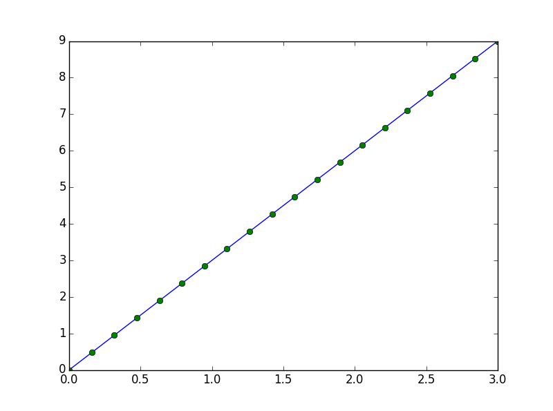
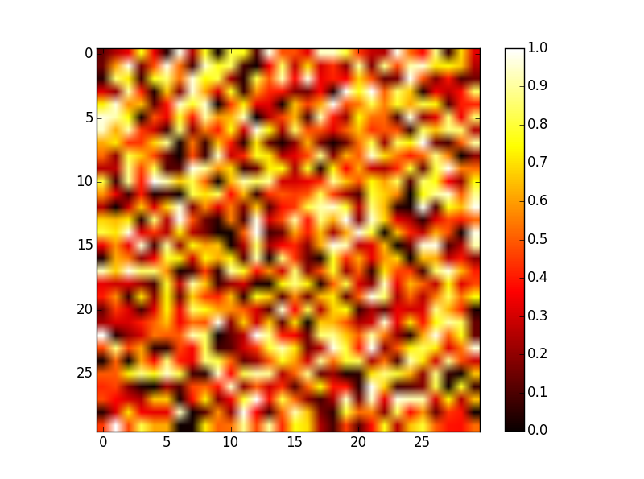

***************************
NumPy: 创建与操作数值数据
***************************

**作者**：*Emmanuelle Gouillart, Didrik Pinte, Gael Varoquaux, and Pauli Virtanen*

**译者**：*ChzRuan*

本章对Python数值计算的高性能核心工具 --- NumPy模块进行综述。

=======================
NumPy的数组(array)对象
=======================

.. contents:: 本节内容
    :local:
    :depth: 1

-------------------------------
NumPy及NumPy数组(array) 是啥？
-------------------------------

^^^^^^^^^^^^^^^^^^^^^^
NumPy 数组(array)
^^^^^^^^^^^^^^^^^^^^^^

    **Python自带：**
        - 高级数值对象：整数，浮点数
        - 容器：列表(list, 快速插入/追加元素)，字典(dictionary, 快速检索)
    **NumPy提供：**
        - 多维数组
        - 更接近硬件端（高效）
        - 为科学计算设计（便利）
        - 面向数组的计算思想

.. sourcecode:: ipython

    >>> import numpy as np
    >>> a = np.array([0, 1, 2, 3])
    >>> a
    array([0, 1, 2, 3])

一个NumPy数组的内容可以是：
    - 实验/仿真数据（关于时间的分立序列）
    - 测量装置的采样信号。例：声波
    - 图片（灰度图或色图）的像素点
    - 在不同的X-Y-Z位置观测的3-D数据。例：核磁共振扫描
    - ...

**NumPy数组的优点**：它的内存管理更高效，因此数值计算速度更快。

.. sourcecode:: ipython

    In [1]: L = range(1000)
    
    In [2]: %timeit [i**2 for i in L]
    1000 loops, best of 3 : 403 us per loops
    
    In [3]: a = np.arange(1000)
    
    In [4]: %timeit a**2
    100000 loops, best of 3 : 12.7 us per loops

^^^^^^^^^^^^^^^^^^^^^^
NumPy帮助文档
^^^^^^^^^^^^^^^^^^^^^^

    - 网址： http://docs.scipy.org/
    - 交互式帮助：
    .. sourcecode:: ipython

        In [5]: np.array?
        String Form:<built-in function array>
        Docstring:
        array(object, dtype=None, copy=True, order=None, subok=False, ndmin=0, ...

    - 查阅帮助信息：
    
    .. sourcecode:: ipython

        >>> np.lookfor('create array')
        Search results for 'create array'
        ----------------------------------
        numpy.array
            Create an array
        numpy.memmap
            Create a memory-map to an array stored in a *binary* file on a disk

    .. sourcecode:: ipython
    
        In [6]: np.con*?
        np.concatenate
        np.conj
        np.conjugate
        np.convolve

^^^^^^^^^^^^^^^^^^^^^^
导入名的惯例
^^^^^^^^^^^^^^^^^^^^^^
    
    NumPy模块导入的惯例是：
    
    .. sourcecode:: ipython

        >>> import numpy as np

-------------------------------
创建数组(np.array)
-------------------------------

^^^^^^^^^^^^^^^^
手动创建数组
^^^^^^^^^^^^^^^^

    - **一维**：
    .. sourcecode:: ipython
    
        >>> a = np.array([0, 1, 2, 3])
        >>> a
        array([0, 1, 2, 3])
        >>> a.ndim
        1
        >>> a.shape
        (4,)
        >>> len(a)
        4

    - **二维，三维，…**：
    
    ::
    
        >>> b = np.array([[0, 1, 2], [3, 4, 5]]) # 2 x 3 数组
        >>> b
        array([[0, 1, 2],
               [3, 4, 5]])
        >>> b.ndim
        2
        >>> b.shape
        (2, 3)
        >>> len(b) # 返回数组b的第一维长度
        2
        
        >>> c = np.array([[[1], [2]], [[3], [4]]])
        >>> c
        array([[[1],
                [2]],
               [[3]],
                [4]]])
        >>> c.shape
        (2, 2, 1)

    **练习：简单数组**

        - 创建一个简单的二维数组。首先照着上边的例子重复一下，And then create your own: how about odd numbers counting backwards on the first row, and even numbers on the second?
        - 将 `len()`_ 和 ``numpy.shape()`` 函数作用于上面的数组。这两个函数有什么联系？它们和 ``ndim`` 方法有什么联系？
            
        .. _len(): https://docs.python.org/2.7/library/functions.html#len

^^^^^^^^^^^^^^^^
函数创建数组
^^^^^^^^^^^^^^^^

实践中很少像上面那样逐个输入数组元素... 通常使用内置函数自动创建各种数组。

    - 均匀分布：
    
    ..sourcecode:: ipython
    
        >>> a = np.arange(10) # 0 .. n-1 (!)
        >>> a
        array([0, 1, 2, 3, 4, 5, 6, 7, 8, 9])
        >>> b = np.arange(1, 9, 2) # start, end (数组不含end), step
        >>> b
        array([1, 3, 5, 7])
    
    - 或者指定数组元素个数：
    
    ..sourcecode:: ipython
        
        >>> c = np.linspace(0, 1, 6) # start（起始值）, end（终止值）, num-points（数组元素个数）
        >>> c
        array([ 0. , 0.2, 0.4, 0.6, 0.8, 1. ])
        >>> d = np.linspace(0, 1, 5, endpoint=False) # endpoint=False: 数组不含终止值1
        >>> d
        array([ 0. , 0.2, 0.4, 0.6, 0.8])
    
    - 常用数组：
    
    .. sourcecode:: ipython
    
        >>> a = np.ones((3, 3)) # 注意: (3, 3) 是一个元组(tuple)
        >>> a
        array([[ 1., 1., 1.],
               [ 1., 1., 1.],
               [ 1., 1., 1.]])
        >>> b = np.zeros((2, 2))
        >>> b
        array([[ 0., 0.],
        [ 0., 0.]])
        >>> c = np.eye(3)
        >>> c
        array([[ 1., 0., 0.],
               [ 0., 1., 0.],
               [ 0., 0., 1.]])
        >>> d = np.diag(np.array([1, 2, 3, 4]))
        >>> d
        array([[1, 0, 0, 0],
               [0, 2, 0, 0],
               [0, 0, 3, 0],
               [0, 0, 0, 4]])
               

    - ``np.random``: 随机数组（使用Mersenne旋转算法生成随机数）
    
    .. sourcecode:: ipython
        
        >>> a = np.random.rand(4) # 生成在区间 [0, 1] 均匀分布的随机数组
        >>> a
        array([ 0.95799151, 0.14222247, 0.08777354, 0.51887998])
        
        >>> b = np.random.randn(4) # Guass分布（正态分布）
        >>> b
        array([ 0.37544699, -0.11425369, -0.47616538, 1.79664113])
        
        >>> np.random.seed(1234) # 设置随机数种子

    **练习：用函数创建数组**
        
        - 使用上面的 ``arange, linspace, ones, zeros, eye`` 以及 ``diag`` 函数。
        - 创建各种随机数组
        - 设置不同的随机数种子创建随机数组
        - 查阅 ``np.empty`` 的帮助文档，它是干啥的？什么时候能用到？

-------------------------------
基本数据类型
-------------------------------
我们观察到有时候数组元素后面会多一个小数点（比如2.），这与数组的数据类型有关：

.. sourcecode:: ipython

    >>> a = np.array([1, 2, 3])
    >>> a.dtype
    dtype('int64')
    
    >>> b = np.array([1., 2., 3.])
    >>> b.dtype
    dtype('float64')
    
采用不同的数据类型可以使数据在内存中更加紧凑地存储，但对大部分场合而言浮点数就够用了。注意在上面的例子里，NumPy自动根据输入的数据类型钦定了数组的数据类型。

数组的类型可以在输入时指定：

.. sourcecode:: ipython

    >>> c = np.array([1, 2, 3], dtype=float)
    >>> c.dtype
    dtype('float64')

**默认的** 数据类型是浮点数：

.. sourcecode:: ipython

    >>> a = np.ones((3, 3))
    >>> a.dtype
    dtype('float64')

其他类型有：

    - **复数**
        
        .. sourcecode:: ipython
            
            >>> d = np.array([1+2j, 3+4j, 5+6*1j])
            >>> d.dtype
            dtype('complex128')
        
    - **Bool型(逻辑型)**
    
        .. sourcecode:: ipython
        
            >>> e = np.array([True, False, False, True])
            >>> e.dtype
            dtype('bool')
        
    - **字符串**
    
        .. sourcecode:: ipython
        
            >>> f = np.array(['Bonjour', 'Hello', 'Hallo',])
            >>> f.dtype # <---  strings containing max. 7 letters
            dtype('S7')
        
    - **还有**：
        + ``int32`` 
        + ``int64`` 
        + ``uint32`` 
        + ``uint64`` 

-------------------------------
数据的基本可视化
-------------------------------
在初步学习了数组之后，我们考虑怎样将数据可视化。

从打开IPython开始：

.. sourcecode:: ipython
    
    $ ipython

或IPython notebook:

.. sourcecode:: ipython

    $ ipython notebook

IPython启动后就可以进行交互式绘图：

.. sourcecode:: ipython

    >>> %matplotlib

或者在notebook里绘图：

.. sourcecode:: ipython

    >>> matplotlib inline

注意inline参数对notebook很重要，只有这样才能将绘图结果在notebook中显示，而非显示在新窗口。

*Matplotlib* 是一个二维绘图的Python模块，可以像之前那样导入此模块的函数：

.. sourcecode:: ipython

    >>> import matplotlib.pyplot as plt # 惯例的导入方式

然后绘制并输出图片（注意，如果没有用 ``%matplotlib`` 命令进入交互绘图的话只能像下面这样完整地调用函数）：

.. sourcecode:: ipython
    
    >>> plt.plot(x, y) # 绘制直线
    >>> plt.show() # <-- 输出图片（在交互绘图模式下不用此语句，图片自动输出）

如果已经用 ``%matplotlib`` 语句进入交互绘图模式，那么用下面的语句就行了：

.. sourcecode:: ipython

    >>> plot(x, y) # 绘制直线

    - **一维数组绘图**：
    
    .. sourcecode:: ipython
    
        >>> x = np.linspace(0, 3, 20)
        >>> y = np.linspace(0, 9, 20)
        >>> plt.plot(x, y) # line plot
        [<matplotlib.lines.Line2D object at ...>]
        >>> plt.plot(x, y, 'o') # dot plot
        [<matplotlib.lines.Line2D object at ...>]
    
    

    - **二维数组** （比如图片）：
    
    .. sourcecode:: ipython
    
        >>> image = np.random.rand(30, 30)
        >>> plt.imshow(image, cmap=plt.cm.hot)
        >>> plt.colorbar()
        <matplotlib.colorbar.Colorbar instance at ...>

更多可视化内容见： :ref:`matplotlib chapter`

 **练习：简单可视化**
    
    -  Plot some simple arrays: a cosine as a function of time and a 2D matrix.
    - 尝试用 ``gray`` 颜色映射绘制上面的二维数组。

-------------------------------
数组索引与切片
-------------------------------
NumPy数组的读取与赋值方式与Python自带的序列(sequence)相同（比如，列表(list)）：

.. sourcecode:: ipython

    >>> a = np.arange(10)
    >>> a
    array([0, 1, 2, 3, 4, 5, 6, 7, 8, 9])
    >>> a[0], a[2], a[-1]
    (0, 2, 9)

.. warning::

    数组索引从0开始，就像Python(以及C/C++)的序列那样。而在Fortran或MATLAB中下标从1开始。

